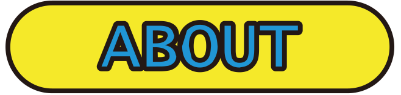
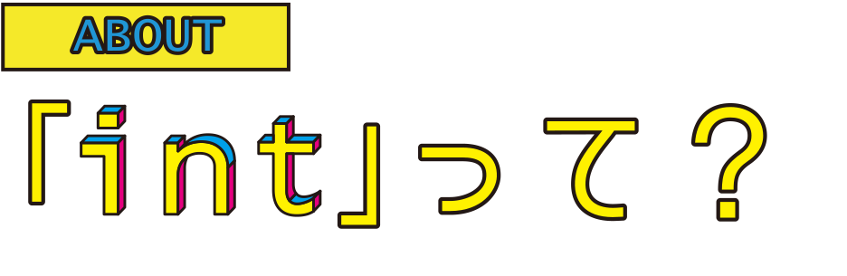

int ハッカソン ウェブページ
====

このリポジトリのウェブページは、ハッカソン「int～新しい遊びを作ろう～」のイベントページです。このREADMEは、今後の当イベントページ担当者に向けたものです。


# ファイル
## css/main.css
自分が追加した
CSS
になります。クラス名などは（
bootstrap
のクラス名などと区別をつけるため）キャメルケースで記述しています。

## imgディレクトリ
ファイル名はスネークケースで記述しています。
以下に例を示します。

```
about_b.svg
about_c.svg
int_t.svg
```

* *_b.svg
となっているものは、ボタン用の画像です。

（例）
about_b.svg



* *_i.svg
となっているものは、円形のボタン（アイコン）の画像です。

（例）


* *_c.svg
となっているものは、見出し用の画像になります。

（例）
about_c.svg



* *_t.svg
となっているものは、ページトップに表示している画像です。

（例）
int_t.svg


## organization_symbolsディレクトリ
イベントを支援して頂いている企業や団体、個人の方々のロゴを置いています。

## htmlディレクトリ
サブページのhtmlファイルを置いています。

## sampleディレクトリ
READMEに使用している画像などのサンプルファイルを置いているディレクトリになります。

# Bootstrapについて
使用している
Bootstrap
は
CDN
を利用して読み込んでいます。
Bootstrap
のバージョンは
3.3.7
になります。

2018-08-08
現在の最新バージョンは
4.1.2
ですが、
Bootstrap3
と
Bootstrap4
の仕様が一部変更になっているようです。そのため、
Bootstrap
を
CDN
を使用せずにローカルに置く場合はバージョンに注意が必要です。
[CDNとは？][cdn]

Bootstrap3
と
Bootstrap4
の違いなどは次の記事が参考になるかもしれません。
[参考記事][difference]

# 制作
宮崎大学Crafter同好会（
[Twitter][twitter_crafter]
/
<a href="mailto:hackathonint@gmail.com">e-mail</a>
）

ハッカソン用（
[Twitter][twitter_int]
/
[Web Page][web_page]
)

画像・デザイン：かいくん（
[Twitter][twitter_kaisan]
）

[cdn]:https://tonari-it.com/bootstrap-cdn/
[difference]:https://coliss.com/articles/build-websites/operation/work/migrate-from-bootstrap3-to-bootstrap4.html
[twitter_crafter]:https://twitter.com/miyazaki_circle
[twitter_int]:https://twitter.com/int08063060
[twitter_kaisan]:https://twitter.com/shimonitanegii
[web_page]:https://myzk-int.github.io
